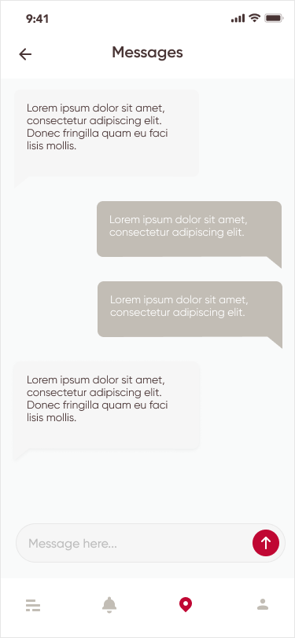

    

**AnotherRailcar** – mobile application that provides navigations, communications and interactions inside a railway station or train with interactive maps, reviews of spots etc.

With our application, you can:
- Get all info about your route
- See what’s inside a station and more
- Find your car and seat on the train
- Get instant notifications about what happens right now
- Report incidents, ask for help

P.S. This is a prototype application developed at [The Big Hack - Digital Edition](https://events.codemotion.com/hackathons/the-big-hack-21/).

&nbsp;&nbsp;
 
&nbsp;&nbsp;
